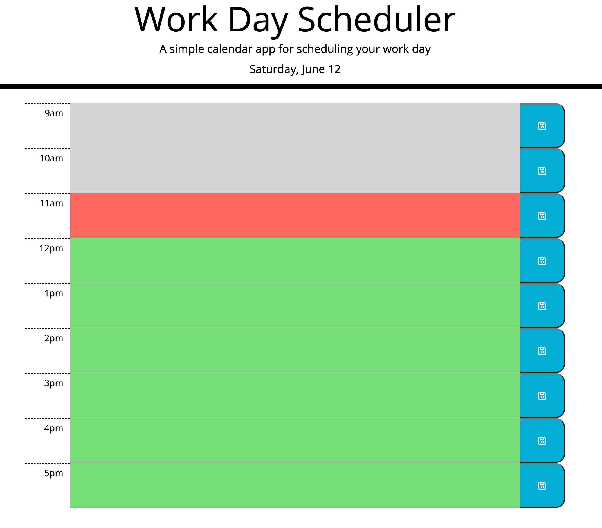
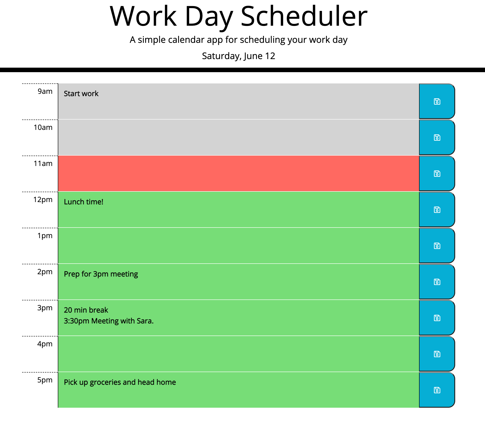

# Work Day Scheduler
## Week 5: Third-Party API Challenge

This repository contains the code for a simple work day scheduler/planner. The user can add tasks to the planner in hour timeblocks. Features include: 
- Planner shows time blocks for a standard business day, 9am - 5pm. 
- Current day always displayed at the top of the page. 
- Timeblocks are color-coded to indicate the current hour of the day.
- Color-coding updates automatically
- Tasks entered can be saved in local storage by clicking the corresponding save button.

Deployed application: https://emholmes.github.io/eholmes-work-day-scheduler-api-challenge/

